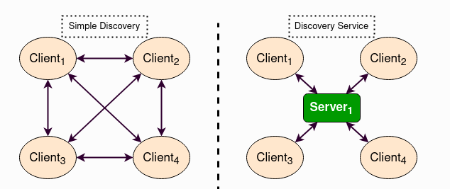

# DDS Notes

DDS (Data Distribution Service) is a way for programs to send and receive data without needing a server. It is used systems where data needs to be shared very fast.

DDS follows **publish-subscribe**

## Some Important DDS Terms
- **Topic** – The type of data being shared.
- **Publisher** – Sends data.
- **Subscriber** – Gets data.
- **DataWriter** – Writes data to a topic.
- **DataReader** – Reads data from a topic.

## DDS in ROS 2
- ROS 2 uses DDS for communication.
- It allows different robot parts to share data easily.
- Some common DDS implementations:
  - **Fast-DDS** (by eProsima)
  - **Cyclone DDS**

## Discovery in DDS
- DDS needs a way to find which programs are talking.
- Uses **Discovery Server** to help programs find each other.
- Helps in large networks where multiple programs need to talk.

## Why is DDS Better Than Normal Networks?
| Feature          | DDS       | Normal Network |
|-----------------|----------|---------------|
| Speed          | Fast      | Slower        |
| Real-time      | Yes       | No            |
| Needs a Server | No        | Yes           |
| Handles Big Data | Yes      | No            |

## Conclusion
DDS is important for sharing data quickly and reliably. It is widely used in robotics, self-driving cars, and other systems that need real-time data exchange.
